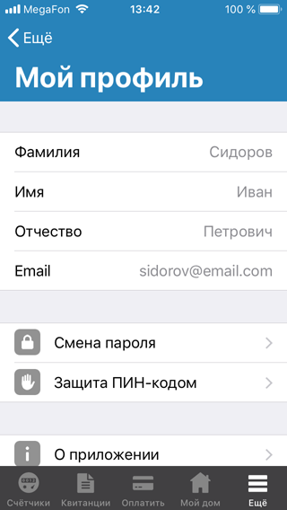
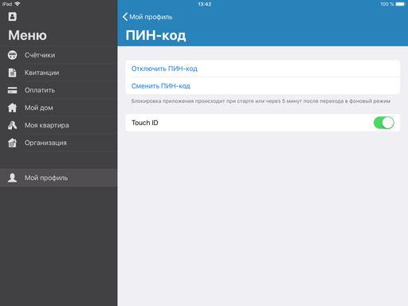

# КВАДО.РУ

## Описание
КВАДО.РУ — iOS приложение для клиентов компании Квартплата Онлайн, которое позволяет им использовать функции личного кабинета пользователя. Оно создано, чтобы дублировать некоторые функции личного кабинета пользователя, которыми до этого можно было воспользоваться только с помощью браузера, что не всегда удобно. Приложение позволяет делать это более комфортно с экрана смартфона или планшета.

Клиент компании может передавать в управляющую компанию показания счётчиков, просматривать и оплачивать квитанции, просматривать информацию о своём дома, квартире и управляющей организации, сменить пароль или дополнительно установить защитный ПИН-код, с поддержкой Touch ID или Face ID.

## Информация
Совместимость - iOS 8.0 или выше  
Среда разработки - Xcode 9.3  
Язык - Swift 4.1

## Снимки экрана (iPhone)

## Снимки экрана (iPad)

