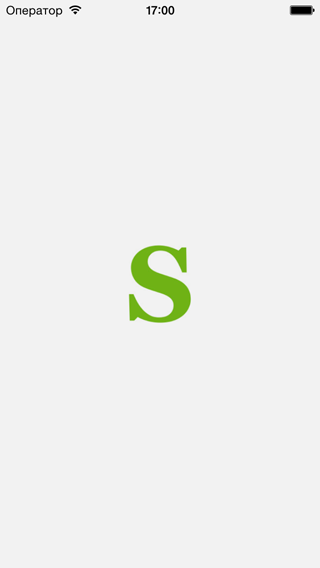
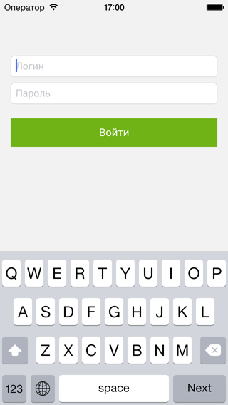
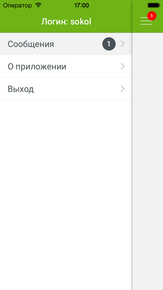
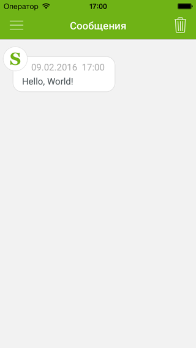
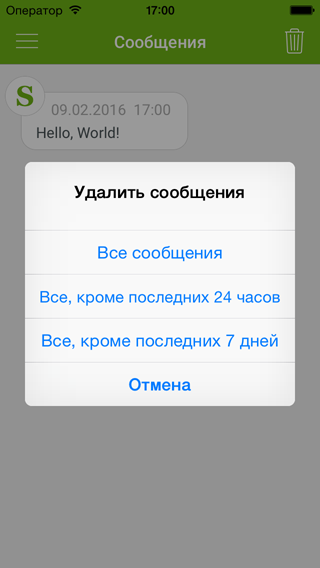
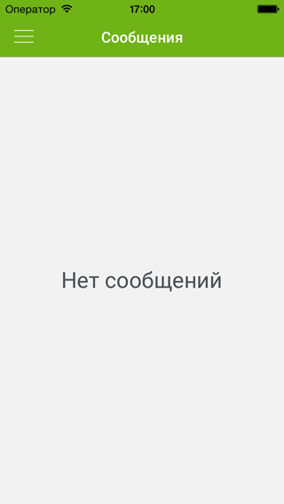

# SkyNet Genisys

## Описание
SkyNet Genisys — iOS приложение для сотрудников компании SkyNet, которое позволяет им получать бесплатные сообщения с сервера компании (вместо SMS‑сообщений).

Приложение выпущено под корпоративной лицензией Apple Developer Enterprise Program, то есть оно распространяется не через App Store, а только внутри компании.

## Информация
Совместимость - iOS 7.1 или выше  
Среда разработки - Xcode 6.4  
Язык - Swift 1.2

## Снимки экрана (iPhone)

