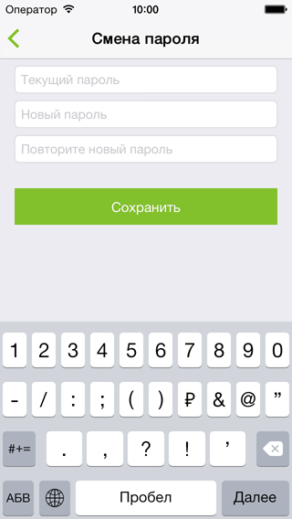

# SkyNet Личный кабинет

## Описание
SkyNet Личный кабинет — iOS приложение для клиентов компании SkyNet, которое позволяет им использовать функции личного кабинета пользователя. Оно создано, чтобы дублировать некоторые функции личного кабинета пользователя, которыми до этого можно было воспользоваться только с помощью браузера, что не всегда удобно. Приложение позволяет делать это более комфортно с экрана смартфона.

Клиент компании может получать информационные сообщения, читать ленту новостей, просматривать свой текущий баланс и историю платежей, класть деньги на счёт с карты, при необходимости активизировать услугу «Отложенный платёж», просматривать список подключённых услуг, при необходимости сменить тариф прямо из приложения, сменить MAC‑адрес роутера (доступна функция автоопределения MAC‑адреса нового роутера), сменить пароль, узнать адреса центров обслуживания и их местоположение на карте.

## Информация
Совместимость - iOS 7.1 или выше  
Среда разработки - Xcode 6.4  
Язык - Swift 1.2

## Снимки экрана (iPhone)

